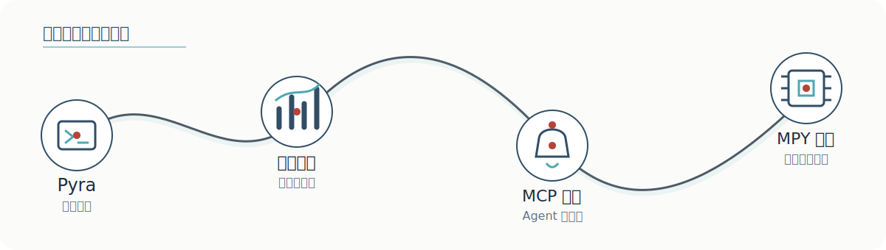

<!--
[INPUT]: 依赖 assets/xiaofeng-github-hero.png、assets/ink-divider.svg、assets/project-map.svg 与 assets/xiaofeng-seal.svg，以及 GitHub 公开仓库和 ericoding.cc 的项目事实
[OUTPUT]: 对外提供“晓峰”的古风 GitHub 个人主页、项目器物志、近思录与站外入口
[POS]: Profile 仓库的唯一展示入口，以数字长卷结构统一个人 IP、作品证据和长期方向
[PROTOCOL]: 变更时更新此头部，然后检查 AGENTS.md
-->

  

  

<h1 align="center">晓峰 · 一介写代码的手艺人</h1>

  <strong>以代码为器，以问题为师。</strong> 
  在古风与现代技术之间，做能运行、能验证、能交付的东西。

  <a href="https://ericoding.cc">山门 · 个人主页</a>
  &nbsp;·&nbsp;
  <a href="https://github.com/sheacoding?tab=repositories">藏器 · 全部项目</a>

<h2 align="center">卷首 · 此间人</h2>

  古风是衣，工程是骨。 
  我关心的从来不是技术看起来多厉害，而是它能否走出屏幕，解决一个真实问题。

<table align="center" width="100%">
  <tr>
    <td width="33%" align="center">
      所 修 
      <strong>AI 开发工具</strong> 
      让复杂能力有简单入口
    </td>
    <td width="33%" align="center">
      所 造 
      <strong>自托管自动化</strong> 
      让数据与系统归自己掌控
    </td>
    <td width="33%" align="center">
      所 传 
      <strong>硬件与科创教育</strong> 
      让创造发生在真实世界
    </td>
  </tr>
</table>

 

<h2 align="center">卷一 · 器物志</h2>

器不在多，在于经得起真实使用。

<table align="center" width="100%">
  <tr>
    <td width="33%" valign="top">
      <h3>壹 · <a href="https://github.com/sheacoding/ad-revenue-pulse">AdRevenuePulse</a></h3>
      
私有化聚合多个微信流量主账号的收益、看板与定时报表。

      Bun · Hono · PostgreSQL · React
    </td>
    <td width="33%" valign="top">
      <h3>贰 · <a href="https://github.com/sheacoding/mcp-reminder">mcp-reminder</a></h3>
      
支持自然语言时间解析与主动通知的 MCP 闹钟和待办服务。

      Python · MCP
    </td>
    <td width="33%" valign="top">
      <h3>叁 · <a href="https://github.com/sheacoding/mpy-studio">mpy-studio</a></h3>
      
面向 ESP32 / ESP32-S3 的 MicroPython 开发、设备控制与 Wokwi 仿真扩展。

      Python · TypeScript · VS Code
    </td>
  </tr>
</table>

 

<h2 align="center">卷二 · 近思录</h2>

<table align="center" width="100%">
  <tr>
    <td width="33%" align="center" valign="top">
      <h3>先 行</h3>
      
最小可运行， 胜过宏大设想。

    </td>
    <td width="33%" align="center" valign="top">
      <h3>求 真</h3>
      
让系统可观察， 让结论可验证。

    </td>
    <td width="33%" align="center" valign="top">
      <h3>留 痕</h3>
      
记录关键决策， 不让系统依赖记忆。

    </td>
  </tr>
</table>

<blockquote>
  
<strong>真正的长期主义，不是把路说得很远，而是把今天手上的东西做好。</strong>

</blockquote>

<h3>眼下三件事</h3>

- 让自托管数据与自动化工具更简单、更可靠
- 把 AI Coding Agent 从演示变成可复用、可验证的工程工作流
- 连接软件、硬件与教育，让工具真正走出屏幕

 

<h2 align="center">卷尾 · 山水有相逢</h2>

  学计算机，也学英语。 
  说到底，都是为了自由。

  <a href="https://ericoding.cc"><strong>入山门，见更多作品 →</strong></a>

   
  晓峰 · Ericoding

